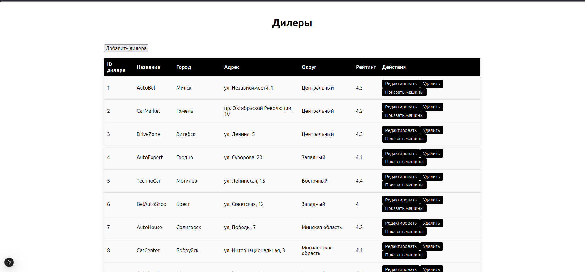
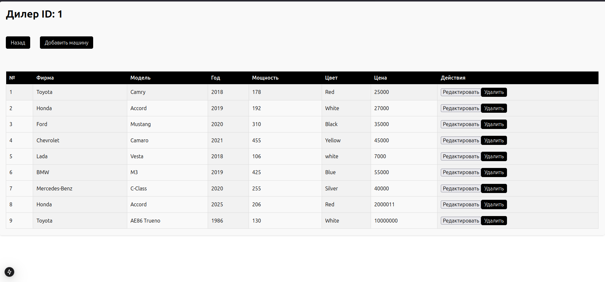
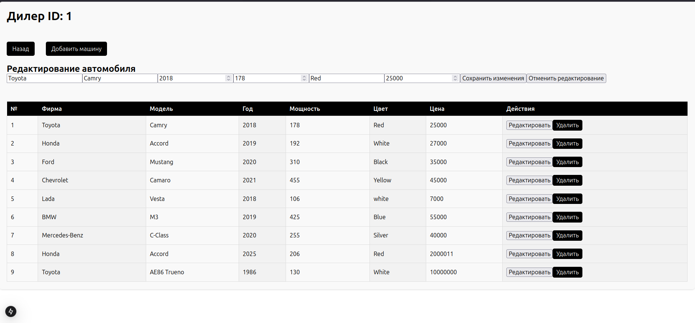

**Проект представляет собой REST API для управления дилерами и автомобилями. Разработан в рамках университетского курса по Java-разработке.**

**Стек технологий**
- Java 17, Spring Boot 3
- Spring Data JPA (Hibernate)
- PostgreSQL (прямые JDBC-запросы также используются)
- Jackson (JSON)
- Maven

**База данных**
Используется PostgreSQL. Настройки подключения жёстко заданы в DataBase.java.
Таблицы: cars, dealers, affiliation (связь многие-ко-многим).

***Запуск***
- Создать БД WebWork и таблицы (скрипты см. в коде).
- Собрать: mvn clean install
- Запустить: mvn spring-boot:run (или через IDE)
- Приложение доступно по http://localhost:8080

**API**
- Метод	Эндпоинт	Описание
- GET	/dealers	Список всех дилеров
- POST	/dealers	Добавить дилера (JSON)
- PUT	/dealers/{id}	Обновить дилера
- DELETE	/dealers/{id}	Удалить дилера
- GET	/cars/{dealerId}	Автомобили дилера
- DELETE	/dealers/{dealerId}/cars/{carId}	Удалить связь авто с дилером
- PUT	/cars/{carId}	Обновить автомобиль (вставляет новую запись, баг учебный)

*Пример JSON для дилера:*
json = {"Name":"Автоцентр","City":"Москва","Address":"ул. Ленина, 1","Area":"Центр","Rating":4.8}
*Пример JSON для авто:*
json = {"Firm":"Toyota","Model":"Camry","Year":2020,"Power":200,"Color":"Black","Price":25000}

*Особенности*
- Используются одновременно JPA-репозитории и JDBC (класс DataBase).
